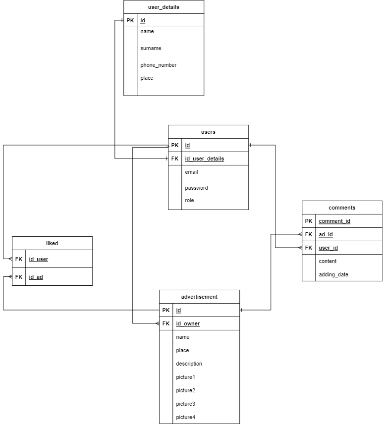

<p align="center">

</p>

# Uczciwa-Cena

A web application where you can post your announcements to give out your unused things and search for the things which you need, but don't want to buy.
This application helps to find amazing finds in your neighbourhood.
 
 
# Technologies
- PHP
- JS
- HTML/CSS
- PostgreSQL


# Requirements
- [Docker](https://www.docker.com/)


# Installation

1. Clone the repository from Github:

```
git clone https://github.com/zannna/Uczciwa-Cena.git
```

2. Create an .env file, which includes database connection details. 

```
DB_NAME=''
DB_USER=''
DB_PASSWORD=''
```

3. Open terminal and run commands:

```
docker compose build
```

```
docker compose up
```

4. Access it by visiting http://localhost:8080 in your web browser.


# Database


